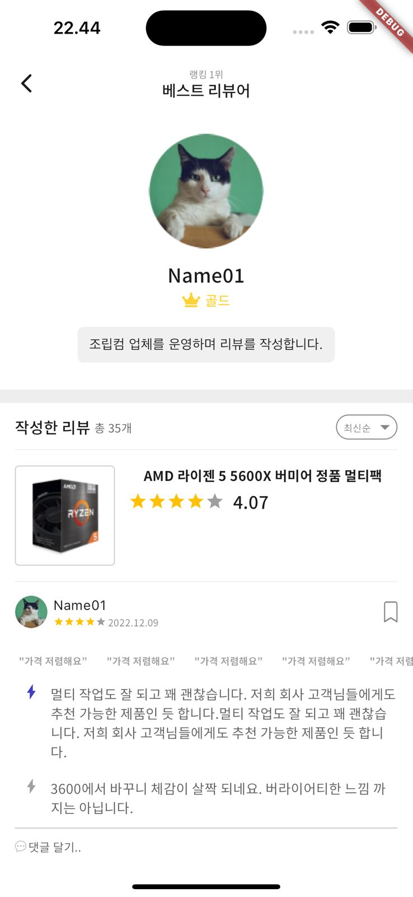

# HyperHire

Welcome to HyperHire, a Flutter project designed to streamline the hiring process with a focus on efficiency and user experience.

## Getting Started

These instructions will get you a copy of the project up and running on your local machine for development and testing purposes.

### Prerequisites

Before you begin, ensure you have the following tools installed:

- Flutter (version as specified in `pubspec.yaml`, sdk: '>=3.3.0 <4.0.0')
- Dart (compatible with the Flutter SDK version you're using)
- Android Studio or Visual Studio Code with Flutter and Dart plugins installed
- An emulator or physical device to run the app

## Download apk

You can download the apk from

https://github.com/IzraelAA/hyperhire/app-release.apk

## Page Examples

Here are some examples of the pages in the app:





### Installation

1. Clone the repository to your local machine:

```bash
git clone https://github.com/IzraelAA/hyperhire.git
